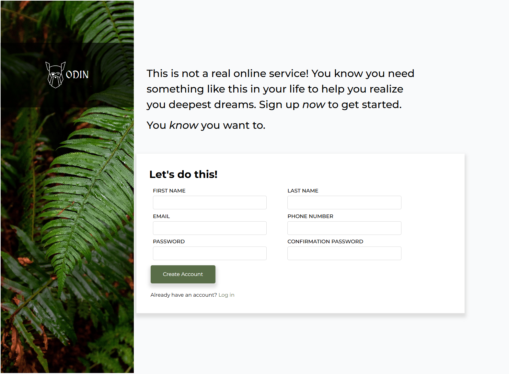

# signup-form
Simple Sign Up Form

  

## Overview:

## Live Solution: [Signup-form]("https://ioangheraszim.github.io/signup-form/")

## Requirements: 

1. How you attack this project is mostly up to you, but it is wise to begin by scaffolding out the structure of the page, and then tackle the various sections one by one.
2. The area behind the “ODIN” logo is a div that has a dark, but semi-transparent background color. This enhances the readability of the text against the busy background image.
3. The color we’ve chosen for the ‘Create Account’ button is similar to tones found in the background image. Specifically, it is #596D48.
4. The inputs, by default have a very light border (#E5E7EB), but we’ve included 2 variations. For starters, the password inputs should have a red border if they contain an invalid password. This can be handled with the :invalid pseudo-class you’ve learned in the previous lesson.
5. The other variation is the selected input, which should have a blue border and subtle box-shadow. This can be done with the :focus pseudo-class you’ve learned about in an earlier lesson.
6. Do not worry about making your project look nice on mobile. Responsive design isn’t covered until later in the curriculum.
7. Validating that the password fields match each other requires JavaScript. Using JavaScript to validate forms is covered in a future lesson. For now, just validate each field separately.

### Built with

- Semantic HTML5 markup
- CSS custom properties
- Flexbox
- Mobile-first workflow